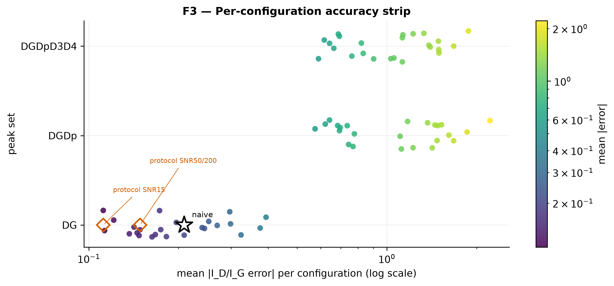

[](https://doi.org/10.5281/zenodo.20918643)

# RamanUQ v2.1

Open, validated pipeline quantifying how analysis choices affect Raman defect
metrics (I_D/I_G) in carbon nanomaterials.

I_D/I_G is the standard Raman measure of disorder and defect density in carbon nanomaterials, yet on hostile synthetic ground truth no peak-fitting configuration met our pre-registered coverage floor, meaning the error bars routinely reported on this ratio undercover the truth under realistic misspecification and the uncertainties used to compare materials across studies can overstate precision, on the spectra and regimes tested here.


An evidence-based protocol detected smaller changes in I_D/I_G than a naive default pipeline in every regime tested, tightening the smallest real shift a study can claim, such as the kind a hydrogenation or defect-engineering step is meant to produce, without asserting any universally correct procedure, on the regimes tested here.



## Quickstart

```bash
# Install (editable) and run the test suite.
python3 -m pip install -e .
python3 -m pytest -q

# Recompute the report numbers from the frozen study parquet.
python3 -c "from ramanuq.reporting import write_report_data; write_report_data()"

# Regenerate the figures (F1–F9).
python3 scripts/make_all_figures.py

# Assemble the report draft from the template + recomputed numbers.
python3 scripts/build_report.py
```

The recomputed numbers live in `docs/report_data.json`; `scripts/build_report.py`
injects them into `docs/report_template.md` to produce `docs/report_draft.md`
(and `docs/report.pdf` when pandoc is installed).

## Validation gates

| Gate | What it checks | Tolerance |
| --- | --- | --- |
| V1 | Parameter recovery | < 0.1% relative recovery error |
| V1b | Empirical 95% coverage band | 0.90–0.98 |
| V2 | Baseline fit | < 2% of G-band height (in-class) |
| V3 | Hostile-spectrum bias | mean abs bias < 0.05 (≥ 1 class, stage-1 / SNR 50) |
| V4 | Selector sanity (rigged) | exact recovery (atol 1e-12) |
| V5 | Published-spectrum reproduction | within ±10% of ≥ 1 digitized published spectrum |
| V6 | Cross-implementation agreement | 1e-9 relative (analytic) / 1e-6 (numerical) |

Recomputed gate state and per-regime numbers are in `docs/report_data.json`.

## Protocol

Per-regime configuration recommendations and scope are in
[`docs/protocol.md`](docs/protocol.md).

## Citation

If you use this software, please cite it using the metadata in
[`CITATION.cff`](CITATION.cff).

## AI-usage disclosure

AI assistance on this project is logged in
[`docs/provenance/ai_usage_log.md`](docs/provenance/ai_usage_log.md).
